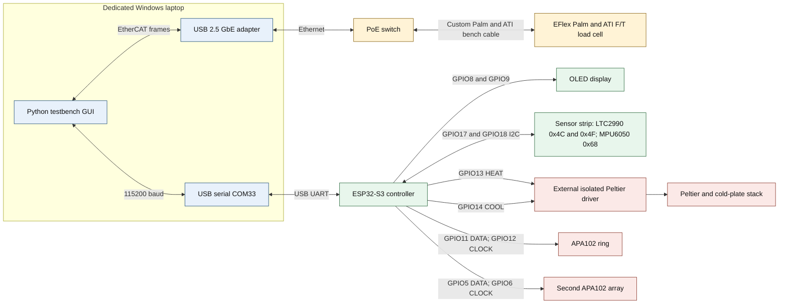

# EFlex thermal and load-cell testbench

## Purpose

This bench records ATI force/torque data and temperatures while controlling a Peltier stack. One Windows laptop runs the Python GUI. The load cell uses EtherCAT through a dedicated USB Ethernet adapter. The ESP32-S3 handles temperature sensing, the OLED, LEDs, and the active-high heating and cooling requests.

## System map

Source diagram: [system-overview.mmd](system-overview.mmd)

## Physical connection order

### Load-cell lane

1. Connect the dedicated USB 2.5 GbE adapter to the laptop.
2. Connect that adapter to the PoE switch.
3. Connect the switch to the custom Ethernet-to-EFlex Palm/ATI harness.
4. Connect the harness to the EFlex Palm and ATI EtherCAT F/T sensor.
5. In the GUI, select the Realtek USB 2.5 GbE adapter and the **ATI Load Cell** profile.

The custom harness is not a documented commodity-Ethernet cable. Its conductor pinout is not present in this repository. Do not infer power or signal assignments from standard RJ45 PoE pinouts; use the released harness drawing or verify the existing cable before rebuilding it.

### Temperature and control lane

1. Connect the ESP32-S3 USB-UART port to the laptop. It is currently COM33 at 115200 baud.
2. Connect the OLED to GPIO8/GPIO9.
3. Connect both LTC2990 devices and the accelerometer to GPIO17/GPIO18.
4. Connect GPIO13 and GPIO14 only to external isolated driver inputs.
5. Connect the external driver to the Peltier power stage and cold-plate stack.
6. Connect the LED ring or array if visual status is required.

The ESP32 GPIOs are logic outputs only. They must not power a Peltier, relay coil, fan, pump, or other load directly.

## ESP32-S3 pinout

| Function | Pin | Direction | Notes |
|---|---:|---|---|
| Touch/page input | GPIO4 | Input | Capacitive page control |
| Second APA102 data | GPIO5 | Output | Shared animation frame |
| Second APA102 clock | GPIO6 | Output | Shared animation frame |
| LED clock selector | GPIO7 | Input | Button to GND; internal pull-up |
| OLED SDA | GPIO8 | I2C | Dedicated OLED bus |
| OLED SCL | GPIO9 | I2C | Dedicated OLED bus |
| APA102 ring data | GPIO11 | Output | Use a level shifter for 5 V LEDs |
| APA102 ring clock | GPIO12 | Output | Use a level shifter for 5 V LEDs |
| HEAT request | GPIO13 | Output | Active high; external pull-down required |
| COOL request | GPIO14 | Output | Active high; external pull-down required |
| Sensor-strip SDA | GPIO17 | I2C | LTC2990 and accelerometer bus |
| Sensor-strip SCL | GPIO18 | I2C | 50 kHz in current firmware |

Thermal output states are mutually exclusive:

| GPIO13 HEAT | GPIO14 COOL | State |
|---:|---:|---|
| 0 | 0 | Idle |
| 1 | 0 | Heat |
| 0 | 1 | Cool |
| 1 | 1 | Invalid; firmware interlock prevents this state |

Firmware switches both outputs off for 500 ms before reversing direction. External pull-downs keep both driver inputs off during reset or loss of ESP32 power.

## Sensor strip

| Device | Bus/address | Purpose |
|---|---|---|
| LTC2990 A | I2C `0x4C` | Temperature, supply, and differential-voltage channels |
| LTC2990 B | I2C `0x4F` | Second temperature and voltage measurement point |
| MPU6050 | I2C `0x68` | Motion/disturbance indication |
| LIS3DH | I2C `0x18` or `0x19` | Supported accelerometer fallback |

Both LTC2990 devices share GPIO17/GPIO18. Device A uses A1/A0 low. Device B uses A1/A0 high. The current COM33 bench has detected both LTC2990 devices and an MPU6050.

References:

- [LTC2990 product page and data sheet](https://www.analog.com/en/products/ltc2990.html)
- [MPU-6000/MPU-6050 data sheet](https://invensense.tdk.com/wp-content/uploads/2015/02/MPU-6000-Datasheet1.pdf)
- [Firmware pinout and serial protocol](../firmware/esp32s3/README.md)

## Laptop and GUI

The laptop is the bench coordinator. It runs:

- `pysoem` for EtherCAT discovery and cyclic ATI process-data reads.
- `pyserial` for ESP32 telemetry and thermal commands.
- Tkinter for controls.
- Matplotlib for force, torque, temperature, threshold, and output-state plots.
- CSV capture for synchronized load-cell and serial records.

The GUI has three main views:

- **Live:** force, torque, and thermal traces.
- **Analysis:** saved-data review and thermal-drift characterization.
- **Serial Monitor:** ESP32 telemetry, Hold/Cycle thermal controls, and the compact thermal state graph.

### Hold mode

Hold mode sends one target, one idle window, and one sensor selection to the ESP32. The firmware decides HEAT, IDLE, or COOL from the measured temperature.

### Cycle mode

Cycle mode changes between high and low target temperatures on fixed timers. It does not wait for the measured temperature to reach a goal. The GUI shows the active phase and remaining time. Heat, Cool, or Idle stops the cycle scheduler before applying the manual command.

## Data paths

### ATI load cell

The GUI uses the selected USB Ethernet adapter as an EtherCAT master. It identifies the ATI sensor by vendor/product identity and reads cyclic process data. The current decoder interprets the first 24 input bytes as six little-endian signed 32-bit values: Fx, Fy, Fz, Tx, Ty, and Tz. Engineering scaling and calibration must be confirmed against the sensor calibration record before formal measurements.

### ESP32 telemetry

The ESP32 sends LTC2990 readings, sensor quality, accelerometer state, thermal mode, target, idle window, and output state over 115200-baud serial. The GUI parses these lines into the thermal plots and CSV log.

## Code map

### Python GUI

| Block | Responsibility |
|---|---|
| Adapter discovery | Lists network adapters and selects the dedicated EtherCAT interface |
| EtherCAT worker | Enters OP state, reads ATI PDO data, and queues samples |
| Serial worker | Reads ESP32 lines without blocking the GUI |
| Thermal parser | Extracts `4C`, `4F`, mode, target, and output state |
| Hold controller | Sends a single `THERMAL AUTO` goal |
| Cycle scheduler | Alternates high/low goals using elapsed time only |
| Plot and logging | Draws live data and writes synchronized CSV files |

### ESP32 firmware

| Block | Responsibility |
|---|---|
| `setup()` | Initializes safe outputs, I2C buses, OLED, LEDs, Wi-Fi, and timers |
| LTC2990 reader | Configures devices, validates readings, and recovers the I2C bus |
| Serial command parser | Handles thermal and LED commands |
| Thermal state machine | Applies Hold logic and the HEAT/COOL interlock |
| OLED pages | Shows sensor, bus, motion, and thermal-control status |
| LED update | Drives both APA102 outputs and fault indication |
| Network task | Publishes telemetry without blocking sensor/control work |

## Startup checklist

1. Confirm external Peltier power is off.
2. Connect the load-cell Ethernet chain and ESP32 USB cable.
3. Confirm the expected USB Ethernet adapter and COM port appear.
4. Start the GUI and connect COM33.
5. Confirm both LTC2990 devices report `GOOD`.
6. Confirm the GUI thermal state is IDLE before enabling external Peltier power.
7. Start EtherCAT and check that the ATI working counter is nonzero.
8. Enable CSV logging before beginning a thermal run.

## Safety and known limits

- The software interlock is not a replacement for hardware prevention of simultaneous polarity commands.
- Add external pull-downs, suitable isolation, current protection, and over-temperature cutoff.
- The GUI target range is broad for experimentation; it does not certify the Peltier, fixture, adhesive, sensor, or test article for that temperature.
- Cycle timing starts when a goal is sent, not when the measured temperature reaches it.
- COM33 and the adapter name are machine-specific.
- Do not use the undocumented custom harness pinout as a design reference. Locate the released drawing before reproducing it.